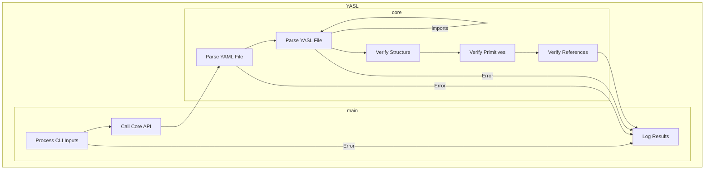

# YASL Design

This design focuses on the software design of YASL rather than the schema language design.
For information on the schema design, review the README.md file.

YASL is a Command Line Interface (CLI) tool optimized for CLI performance and user experience.
YASL is a file processor, not a YAML text processor, due to the inherent support for file imports to avoid monolithic data files.

YASL is organized into a `main` package and a `core` package.
The `main` package contains the CLI implementation.
The `core` package contains the YASL business logic implementation.
This allows the YASL API to be self-contained within `core` to simplify cross-language API wrapper implementation.

## Context

YASL allows the user to specify processing controls through command line parameters.
YASL processing can be further refined through environment variables.
This context information is collected at the initial CLI start and assembled into a context structure which is then passed to the core for execution.
When using YASL via an API, the context structure is passes as a parameter along with the YAML and YASL files to process.

The YASL context contains the following processing parameters:

- Command Line Processing Inputs
  - quiet: bool - `true` to suppress logging other than error messages, `false` otherwise.  Default is `false`.
  - verbose: bool - `true` to enable debug and trace logging, `false` otherwise.
  - outputType: string - Configures logging format. Supported values are `text`, `yaml`, and `json`. Default is `text`.
  - yaml: string - Path to the YAML data file.  May be provided as first non-flagged argument to the CLI or with the `-yaml` flag.
  - yasl: string - Path to the YASL schema file.  May be provided as second non-flagged argument to the CLI or with the `-yasl` flag.

- Environment Variable Inputs
  - YASL_SSL_VERIFY: bool - `true` to verify SSL certificates for URLs, `false` otherwise.  Default is `true`.
  - YASL_PROXY: string - The HTTP proxy to use for URL connectivity. Default is none.
  - YASL_HTTPS_PROXY: string - The HTTPS proxy to use for SSL encrypted URL connectivity. Default is none.

## YASL Behavior

YASL performs a series of sequential behaviors.  At this time, there is no known need for threaded processing.
The following figure provides an overview of YASL's processing flow.



### Process CLI Inputs

CLI processing consists of assembling context and ensuring YAML and YASL files exist on the file system.
Setup the logger based on CLI inputs.
Any errors encounted with inputs should be logged and the applicaiton should terminate.

### Call Core API

Inputs are assembled into the context structure.
Then the core API is called for YASL processing to occur.

The Core API must be maintained in a way to allows for cross-language wrapper integration.
There are 3 parameters:
  - yaml: string - Path to the YAML data file.
  - yasl: string - Path to the YASL schema file.
  - context: map[string]string - Key-value pair of processing controls.

```go
// process_yasl implements the top-level behavioral flow for a YASL processor.
// It takes the raw YAML and YASL content as strings and a context map,
// which can be used for passing configuration like CLI inputs.
// It returns a generic map representing the assembled data model or an error.
func process_yasl(yaml string, yasl string, context map[string]string) (map[string]any, error) {
    ...
}
```

### Parse YAML File

Use the YAMLv3 parser to generate an Abstract Syntax Tree (AST) of the YAML file data.

### Parse YASL FIle

Use the YAMLv3 parser to generate an Abstract Syntax Tree (AST) of the YASL file data.
Check for any imports.
If imports exist, parse them as well.

### Verify Structure

Using the schema information from the YASL file, evaluate the key-value structure within the YAML data.

### Verify Primitives

Traverse each primitive value and primitive list value in the YAML data.
Ensure each value is compliant to any primitive constraints defined in the YASL schema for the data field.

### Verify References

Traverse each reference value, ensuring the target (with applied filters) is valid within the YAML data.

### Log Results

The return of the API will include a result structure.
Loop over data in the result structure and log the provided information.
Terminate the application.

## Cross-Language Support

YASL is designed to support use by other languages, initially Python and JavaScript.
To accomplish this, we must build the `core` YASL capability as a shared library.

```bash
# This creates yasl.so on Linux/macOS or yasl.dll on Windows
go build -buildmode=c-shared -o yasl.so ./core/core.go
```

Note: On Windows, you may want to name the output yasl.dll. On macOS, use yasl.dylib.

### Python

TODO Add details on python library creation and usage.
The Gemini 2.5 Pro generated Python wrapper is in the /api/python/yasl.py file.
Still need to look into Python packaging and publication to PyPi.

### JavaScript

The YASL JavaScript wrapper will only work in a Node.js environment, not in a web browser.
To call the native library from Node.js, you'll need a Foreign Function Interface (FFI) library. The modern standard is `ffi-napi`.

```bash
# Install the FFI library
npm install ffi-napi
```

The Gemini 2.5 Pro generated JavaScript wrapper is in the /api/javascript/yasl.js file.
TODO Still need to look into JavaScript packaging and publication to NPM.